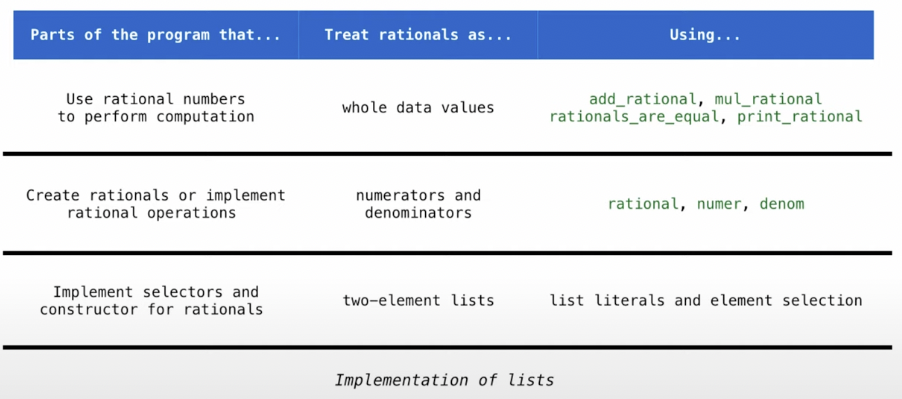

# Data Abstraction

## 1. Introduction to Data Type

> Effective use of *built-in* and *user-defined* data types are fundamental to data processing applications.

### 1.1 Native Data Types

> Every **value** in Python has a **class** that determines what **type** of value it is (value的type称为class).

**Native Data Types**：python内置的数据类型。2个性质：
1. 有expressions的evaluate结果就是value of native data type, 称为字面量(literal)
   * eg: sequences of adjacent numerals，如10000，会evaluate成int value
2. 有内置的functions和operators处理value of native data type
   * eg: 「+」可以处理int value

Python中的三个native numeric types:
1. integers (int，整数)
2. real numbers (float，浮点数)
3. complex numbers (complex，复数)

【注】Float values should be treated as *approximations* to real values (浮点数精度问题).

### 1.2 Data Abstraction

#### 1.2.1 Motivation

> 为什么需要data abstraction？

Many values in programs are *compound values*, a value composed of other values. 例如，一个date是由一个year、一个month与一个day构成的。Data abstraction可以帮助我们manipulate compound values as units——无需关注其具体实现和细节。

#### 1.2.2 Pair: Rational Number

> 一个例子：用pair实现有理数

首先，`pair` data abstraction: 

* `pair(a, b)`: constructs a new pair from the two arguments >>> *constructor*
* `first(pair)`: returns the first value in the given pair >>> *selector*
* `second(pair)`: returns the second value in the given pair >>> *selector*

实现：

```python
def pair(a,b):
    return [a,b]

def first(pair):
    return pair[0]
  
def second(pair):
    return pair[1]
```

其次，利用`pair`实现`rationl number` data abstraction: 

- `rational(n,d)`: 返回一个有理数x
- `numer(x)`返回有理数x的分子
- `denom(x)`返回有理数x的分母

实现:

```python
def rational(n, d):
		"""Construct a rational number that represents N/D."""
		return [n, d]

def numer(x):
		"""Return the numerator of rational number X."""
		return x[0]

def denom(x):
		"""Return the denominator of rational number X."""
		return x[1]
```

基于我们定义的`rationl number`，我们可以继续定义一些对它的操作，如：

* add_rational(x, y)
* mul_rational(x, y)
* ……

此处略，可参考：[Click Me](https://inst.eecs.berkeley.edu/~cs61a/fa21/assets/slides/12-Data_Abstraction.pdf)

#### 1.2.3 Principle: Abstraction Barrier

> data abstraction的核心原则

<div align="middle"></div>

上图中，看待rationals的views有3种

* 一个两元素的list
* 两个数字：分子和分母
* 一个东西：有理数

Abstraction Barriers separate different parts of a program so that each part only needs to know so much about the rest of the program——Each layer only uses the layer above it.

## 2. Sequence

### 2.1 List


### 2.2 String


### 2.3 Tree


### 2.4 Linked List


## 3. Object-Oriented Programming


OOP