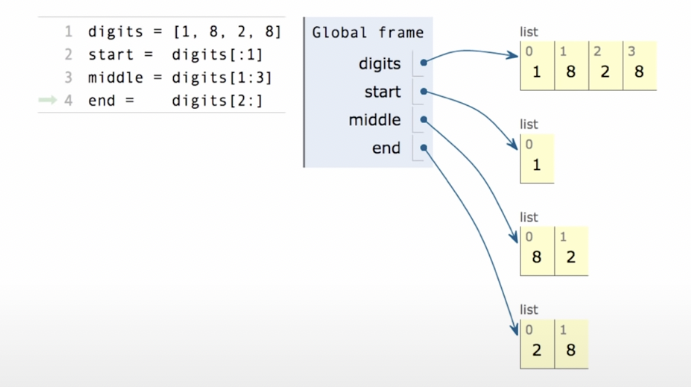
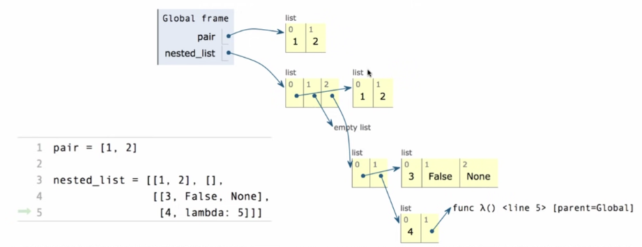

# Data Abstraction

## 1. Introduction to Data Type

> Effective use of *built-in* and *user-defined* data types are fundamental to data processing applications.

### 1.1 Native Data Types

> Every **value** in Python has a **class** that determines what **type** of value it is (value的type称为class).

**Native Data Types**：python内置的数据类型。2个性质：
1. 有expressions的evaluate结果就是value of native data type, 称为字面量(literal)
   * eg: sequences of adjacent numerals，如10000，会evaluate成int value
2. 有内置的functions和operators处理value of native data type
   * eg: 「+」可以处理int value

Python中的三个native numeric types:
1. integers (int，整数)
2. real numbers (float，浮点数)
3. complex numbers (complex，复数)

【注】Float values should be treated as *approximations* to real values (浮点数精度问题).

### 1.2 Build Abstraction to Data

#### 1.2.1 Motivation

> 为什么需要data abstraction？

Many values in programs are *compound values*, a value composed of other values. 例如，一个date是由一个year、一个month与一个day构成的。Data abstraction可以帮助我们manipulate compound values as units——无需关注其具体实现和细节。

#### 1.2.2 Example: Rational Number

> 一个例子：用pair实现有理数

首先，`pair` data abstraction: 

* `pair(a, b)`: constructs a new pair from the two arguments >>> *constructor*
* `first(pair)`: returns the first value in the given pair >>> *selector*
* `second(pair)`: returns the second value in the given pair >>> *selector*

实现：

```python
def pair(a,b):
    return [a,b]

def first(pair):
    return pair[0]
  
def second(pair):
    return pair[1]
```

其次，利用`pair`实现`rationl number` data abstraction: 

- `rational(n,d)`: 返回一个有理数x
- `numer(x)`返回有理数x的分子
- `denom(x)`返回有理数x的分母

实现:

```python
def rational(n, d):
		"""Construct a rational number that represents N/D."""
		return [n, d]

def numer(x):
		"""Return the numerator of rational number X."""
		return x[0]

def denom(x):
		"""Return the denominator of rational number X."""
		return x[1]
```

基于我们定义的`rationl number`，我们可以继续定义一些对它的操作，如：

* add_rational(x, y)
* mul_rational(x, y)
* ……

此处略，可参考：[Click Me](https://inst.eecs.berkeley.edu/~cs61a/fa21/assets/slides/12-Data_Abstraction.pdf)

#### 1.2.3 Abstraction Barrier

> data abstraction的核心原则

<div align="middle"></div>

上图中，看待rationals的views有3种

* 一个两元素的list
* 两个数字：分子和分母
* 一个东西：有理数

Abstraction Barriers separate different parts of a program so that each part only needs to know so much about the rest of the program——Each layer only uses the layer above it.

## 2. Sequence

### 2.1 List

> A list is a container that holds a sequence of related pieces of information.

#### 2.1.1 Basic

**Syntax**

* The shortest list is an empty list, just 2 square brackets
* Lists can hold any Python values, separated by commas

**获取长度**

* `len`: get the number of the list

**获取某个位置的元素**

- index = offset from the beginning (从0开始)
- element selection syntax: `digits[index]`
- `getitem` function: `getitem(digits, index)`

**List concatenation (拼接)**

* 使用「+」运算符
* 使用「add」函数

**List repetition (重复)**

* 使用「*」运算符
* 使用「mul」函数

**Nested lists**

* 略

#### 2.1.2 Lists As Sequences

**Containment**

* Use the `in` operator to test if value is inside a container
* `not in`

**For statements**

主要用于iterate over sequence——帮助我们forget about index！

```python
for <name> in <expression>:
		<suite>
```

**for循环的执行过程**

1. Evaluate the header `<expression>`, which must yield an iterable value (a sequence)
2. For each element in that sequence, in order:
    1. Bind `<name>` to that element in the current frame
    2. Execute the `<suite>`

**Sequence unpacking in for statements**

- `for x,y in pairs`

**List Comprehensions**

```python
>>> odds = [1,3,5,7,9]
>>> [x+1 for x in odds]
[2,4,6,8,10]
>>> [x for x in odds if 25 % x == 0] # 加了if语句：只有满足if语句条件的x，才会被进一步操作>>>filter
[1,5]
```

**List Comprehensions的执行过程: `[<map exp> for <name> in <iter exp> if <filter exp>]`**

1. Add a new frame with the current frame as its parent
2. Create an empty result list that is the value of the expression
3. For each element in the iterable value of ` <iter exp>`:
   1. Bind `<name>` to that element in the new frame from step 1
   2. If `<filter exp>` evaluates to a true value, then add the value of `<map exp>` to the result list

**Slicing (切片)**

slicing creates new values！

<div align="middle"></div>

**Aggregation**

一些内置函数吃iterable的argument，将它聚合成一个值，如sum函数

`sum(iterable[, start])`

* start默认为0
* 返回的结果为：start+iterable中的每个值——得到一个value

`max(iterable[, key=func])` 或 `max(a,b,c,...[, key=func])`

* key函数：iterable中的那个值 such that 代入函数的结果最大

`all(iterable)`

- 返回一个bool值
- Return True if bool(x) is True for all values x in the iterable
- 如果iterable是empty的，返回True

#### 2.1.3 Environment Diagram

在environment diagram中表示list的方法——**Box-and-Pointer Notation**

- List用一行格子表示；
- 每个格子里，要不是一个primitive value，要不是一个箭头指向compound value（如function、another list……）

<div align="middle"></div>

### 2.2 Range

>  另一种sequence——*A `range` is a sequence of consecutive integers*.

`range(-2,2)`：-2，-1，0，1——前闭后开。

- length: ending value - starting value
- element selection: starting value + index

range转list：list函数

### 2.3 String

#### 2.3.1 Strings As Abstraction

作为一种抽象，可以表示；

- representing data
  - 如`'2,400'`
- representing language
  - 如`'您好'`
- representing program
  - 如`'curry = lambda f:lambda x:lambda y:f(x,y)'`
  - 使用exec函数，可以将其执行

String字面量的语法

* 单引号
* 双引号
* 三引号：适用于多行，自动添加\n

#### 2.3.2 Strings As Sequences

和list的性质类似

- 可以用`len`和`[]`
- `in`和`not in`可以用于搜寻substrings

### 2.4 Tree

#### 2.4.1 Two Descriptions

*Recursive description（递归视角）*

* A tree has a **root label** and a list of **branches**
* Each **branch** is itself a **tree**
* A **tree** with zero **branches** is called a **leaf**
* A **tree** starts at the **root**

*Relative description（普通视角）*

* Each location in a **tree** is called a **node**
* Each **node** has a **label** that can be any value
* One **node** can be the **parent/child** of another
* The top node is the **root node**

#### 2.4.2 Data Abstraction

Constructor

* `tree (label, branches)`: Returns a tree with root `label` and list of `branches`

Selector

* `label(tree)`: Returns the root label of tree
* `branches(tree)`: Returns the branches of tree (each a tree)
* `is_leaf(tree)`: Returns true if tree is a leaf node

Implementation

```python
# tree的本质[value, list, list, ...]
# 例: [3, [1], [2, [1], [1]]]

# tree的constructor
def tree(label, branches=[]):
		for branch in branches:
				assert is_tree(branch)
		return [label] + list(branches)

# tree的selector: 获取tree的root label
def label(tree):
		return tree[0]

# tree的selector: 获取tree的branches
def branches(tree):
		return tree[1:]

def is_tree(tree):
		if type(tree) != list or len(tree) < 1:
				return False
		for branch in branches(tree):
				if not is_tree(branch):
						return False
		return True

def is_leaf(tree):
		return not branches(tree)
```

#### 2.4.3 Tree Processing

Counting leaves

```python
def count_leaves(t):
    """Returns the number of leaf nodes in T."""
    if is_leaf(t):
        return 1

    result = 0
    for b in branches(t):
        result += count_leaves(b)

    return result
```

Printing Trees

```python
def print_tree(t, indent=0):
    """Print a tree in a specific formatting."""
    print(' ' * indent + str(label(t)))
    for b in branches(t):
        print_tree(b, indent+1)
```

Counting Paths

```python
def count_paths(t, total):
    """Return the number of paths from the root to any node in tree t for which the labels along the path sum to total."""
    if label(t) == total:
        found = 1
    else:
        found = 0
    return found + sum([count_paths(b, total-label(t)) for b in branches(t)])
```

### 2.5 Linked List


## 3. Mutability


字典：key-value对。

- 是sequence：sequence of keys
- `字典对象.values()`返回一个value的sequence

字典对key的要求：

1. key不能重复
2. key本身不能是list或dict——不能是mutable type

Dictionary Comprehensions：

```
{<key exp>:<value exp> for <name> in <iter exp> if <filter exp>}
```


## 4. Object-Oriented Programming


