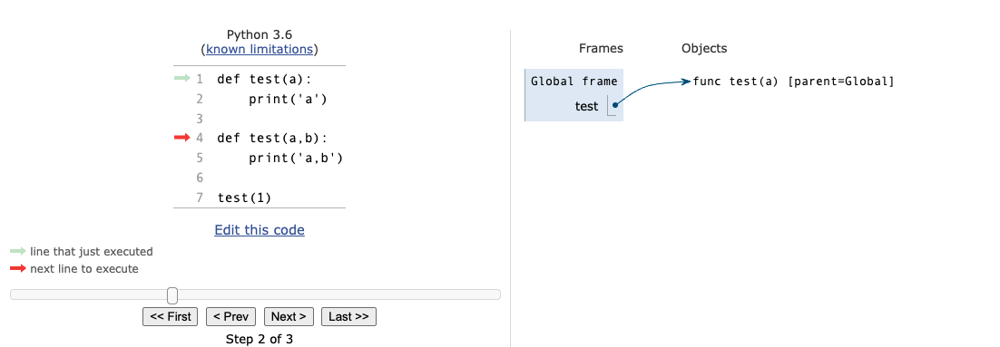

# Functions Abstractions

## 1. Expression and Environment

### 1.1 Expressions

* An expression describes a computation and evaluates to a value.
* 表示了一个计算过程，最终有一个value作为结果。
* 2种类型的expressions：
  * primitive expression
    * number: 如2
    * name: 如add
    * string: 如'hello'
  * call expression
    * 如max(2,3)

**Call Expressions**

- 形为f(x)的expressions.
- All expressions can use function call notation.
- 不需要运算优先级——全凭nesting structure.

**Evaluation Procedure for Call Expressions**

<div align="middle"></div>

1. Evaluate the operator and then the operand subexpressions(先操作符，再操作数).
2. Apply the function that is the value of the operator subexpression to the arguments that are the values of the operand subexpression(操作符和操作数都要evaluate完才能进行计算).

### 1.2 Environment

**Name and Assignment Statement**

* 使用assignment statement 「=」，即「name = expression」，先evaluate右边的expression，然后bind它到左边的name上——这样value就有了name，可以反复使用。
* 除了「=」，还有2种绑定name和value的方法：①import语句 ②def语句

**Environment**

<div align="middle"></div>

* ***Def:** Environment diagrams visualize the interpreter's process.*
* It keeps track of bindings between names and values.
    * 【一个environment由一串frames构成】An environment in which an expression is evaluated consists of a sequence of frames, depicted as boxes.
    * 【每个frame由多个bindings构成】Each frame contains bindings, each of which associates a name with its corresponding value.
    * 【只有一个global frame】There is a single global frame——目前我们也只遇到仅有global frame的场景.

**Execution Rule for Assignment Statements**

1. Evaluate all expressions to the right of = from left to right(等号右边的从左到右依次eval).
2. Bind all names to the left of = to the resulting values in the current frame(将等号左边的name和右边的value一一对应bind起来).

## 2. Defining New Functions

### 2.1 Define a Function

```python
# 其中<name>(<formal parameters>)被称为“function signature(函数签名)”

def <name>(<formal parameters>):
		return <return expression>
```

**def statement执行的规则：**

1. Create a function with signature *\<name>(<formal parameters\>)*  
2. Set the body of that function to be everything indented after the first line
3. Bind *\<name>* to that function in the current frame

<div align="middle"></div>

* An import statement binds a name to a built-in function.
* A def statement binds a name to a user-defined function created by the definition. 
* Each function is a line that starts with func, followed by the function name and formal params. 
* Built-in functions such as mul don't have formal param names, and so ... is always used instead.
* The name appearing in the function is called the ***intrinsic name***.
* The name in a frame is a ***bound name***.
* Different names may refer to the same func, but that func itself has only one intrinsic name.

### 2.2 Call a User-Defined Function

<div align="middle"></div>

**Execution Rule for Calling User-defined Functions**

1. Add a local frame, forming a new environment(local frame的名字一般就用函数的名字).
2. Bind the function's formal parameters to its argument values in that frame.
3. Execute the body of the function in that new environment.

### 2.3 Non-pure Functions

**「print sth.」 vs 「evaluate sth.」**

- 打印None，会显示None；但evaluate None，不会显示None
- 如果一个function 不显示地返回一个值，它返回None
- `None` is not displayed by the interpreter as the value of an expression
- `print(print(1), print(2))`

<div align="middle"></div>

**Pure function** vs **Non-pure function**

- 前者仅仅只return values，不造成其他任何影响
- 后者会造成一些影响——side effects

### 2.4 Multiple Environment: An Example

<div align="middle"></div>

上图中有3个different environments：

* Global frame
* Global frame + f1 frame
* Global frame + f2 frame

**Looking up names in environments**

- An environment = a sequence of frames
- 一个name，在current environment中，最先找到bind的那个frame

**Review: def statement执行的规则>>>画diagram**

1. 定位当前的frame
2. 在该frame里写出function name
3. 在该frame外创建function object
    * *func \<name>(<formal parameters\>) [parent=当前frame]*
    * 若是lambda函数，这里的\<name>写λ
4. 箭头从frame里的function name指向frame外的function object

### 2.5 补充例子

**同名函数**

<div align="middle"></div>

<div align="middle"></div>

<div align="middle"></div>

* 错误原因：执行完第二个def后，在global frame里，test这个name，已经和test(a,b)这个函数实体绑定了，而之前和test这个name绑定的test(a)这个函数实体已经没有了name与它绑定。此时再调用test这个函数并仅传一个参数，就会报错，因为它预期会有两个参数传进来。

## 3. Control Flow

### 3.1 Control Expressions

**Logical operators**

`<left> and <right>`的规则（注意”短路“）

1. Evaluate the subexpression `<left>`.
2. If the result is a false value `v`, then the expression evaluates to `v`.
3. Otherwise, the expression evaluates to the value of the subexpression `<right>.`

`<left> or <right>`的规则（同样”短路“）

1. Evaluate the subexpression `<left>`.
2. If the result is a true value `v`, then the expression evaluates to `v`.
3. Otherwise, the expression evaluates to the value of the subexpression `<right>`.

「短路规则」可以使得一些状况下不crash！

**Conditional expression**

- `<consequent> if <predicate> else <alternative>`
- Evaluation Rule：
    1. Evaluate the `<predicate>` expression.
    2. If it's a true value, the value of the whole expression is the value of the `<consequent>`.
    3. Otherwise, the value of the whole expression is the value of the `<alternative>`.


### 3.2 Conditional statements

<div align="middle"></div>

**Statements**

* A statement is executed by the interpreter to perform an action.
* Compound statements (嵌套) ↑↑↑

**Conditional statements——If**

- Always starts with “if” clause.
- Zero or more “elif” clauses.
- Zero of one “else” clause, always at the end.

**Boolean Contexts**

- False values in Python: `False`, `0`, `''`, `None`, `[]`

### 3.3 Iteration

**「while」 statement**

1. Evaluate the header's expression.
2. If it is a true value,
execute the (whole) suite,
then return to step.

**「for」 statement**

- 暂无

### 3.4 Testing

"Testing a function" is the act of verifying that the function's behavior matches expectations. 

Test的思路：
  1. Contains one or more sample calls to the function being tested.
  2. The returned value is then verified against an expected result.

**方法1：Assertions**

* Expression in a boolean context + A quoted line of text.
* If the expression evaluates to a ***false*** value:
  * Causes an error that halts execution.
  * Display the text.
* If the expression evaluates to a ***true*** value:
  * No effect.

**方法2：Doctests**

Docstring of a function的标准写法

* 【line 1】A one-line description of the function
* 【line 2】A blank line
* 【line 3+】A detailed description of arguments and behavior (optional)
* 【line 3++】a sample interactive session that calls the function，如↓↓↓

```python
>>> def sum_naturals(n):
        """Return the sum of the first n natural numbers.

        >>> sum_naturals(10)
        55
        >>> sum_naturals(100)
        5050
        """
        total, k = 0, 1
        while k <= n:
            total, k = total + k, k + 1
        return total
```

When writing Python in files, all doctests in a file can be run by starting Python with the doctest command line option: `python3 -m doctest <python_source_file>`

## 4. Higher-Order Functions

*What is a Higher-Order Functions?* A function that takes a function as an argument value or returns a function as a return value. 优点：

1. Express general methods of computation
2. Remove repetition from programs
3. Separate concerns among functions

### 4.1 Functions as Arguments

> 将函数作为参数；计算黄金分割比

### 4.2 Nested Definitions

> 在一个函数体中定义另一个函数；考察其间的environments

### 4.3 Functions as Returned Values

> 一个函数的返回值可以是另一个函数；function composition；self-reference

### 4.4 「Application 1」Currying

> 将一个「多参数函数」转换为一个等价的「单参数高阶函数」，即f(x,y)-\>g(x)(y)

### 4.5 「Application 2」Lambda Expressions

> 什么是lambda函数？与def statements的区别？什么时候用它更好？

### 4.6 「Application 3」Decorators

> 本质是一个高阶函数；吃一个函数，吐出该函数的另一个版本——装饰版本

## 5. Recursion