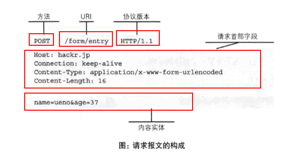
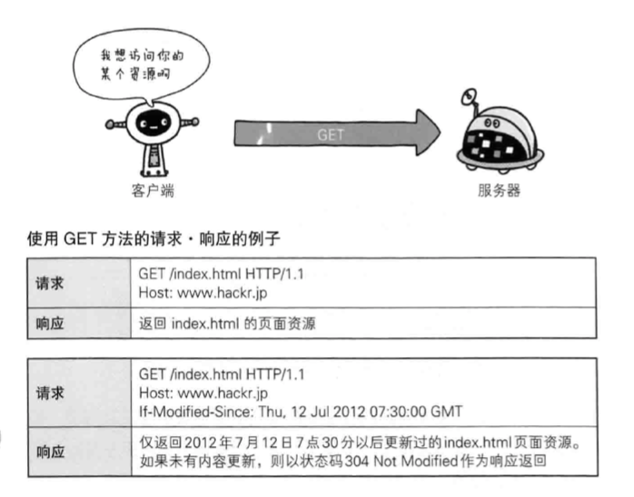
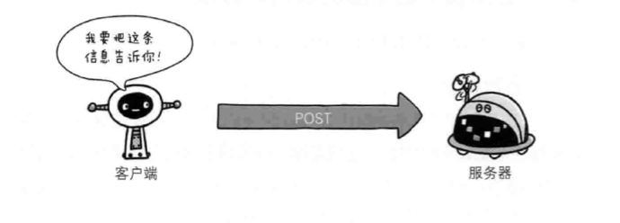
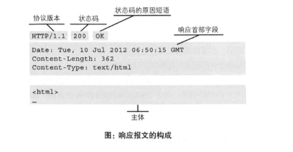

# 网络连接与HTTP协议

## 1. 网络连接过程

**情景**：

* 打开浏览器，在地址栏输入一个网址（URL），敲击回车，浏览器窗口出现相应页面。

**发生了什么**：

* A，如自己的电脑，发送一串1和0组成的比特值，就是信息，包含head和body——head包括了本地路由的MAC地址和B，即服务器的IP地址，还有端口号，对应到具体的服务器应用，总之就是定位用的；body包括，A对B上面某个应用的请求内容，即告诉服务器及应用我要干嘛；
* A的信息先到本地路由，打包一下，根据B的IP地址发到B那里；
* B接到数据包，解析，拿到请求头中的端口号，找到其上的目标应用，发过去；
* 服务器应用从B，即服务器那里收到数据，看一看body，看A到底要啥：比如要一个index.html这个文件；
* 服务器应用找到这个文件，通过服务器，把这个文件发回A去；
* A收到index.html，用浏览器渲染一下，显示出来，bingo！

**简单来说**：
* 一般来讲（有不一般的情况），打开一个网页，就是通过HTTP协议，向指定服务器对一个资源进行请求，服务器回应请求并返回一份HTML文档，浏览器对这个文档进行渲染，显示出来，成了我们看到的网页。

## 2. HTTP协议

### 1) 概述

HTTP协议，全称超文本传输协议，HyperText Transfer Protocol。

HyperText，超文本，可超链接文档，该文档可以指向其他位置——当前文档中、局域网中的其他文档、全网的任何位置的文档，这些文档组成了一个杂乱的信息网。

HTTP协议，是一套关于HyperText传输规定，例如包括了客户端和服务端的数据传输格式的规定等等，用于服务器传输超文本到本地计算机（浏览器）。

HTML，HyperText Markup Language，所以HTTP协议最初建立是为传HTML的。

### 2) 内容及特性

#### a. HTTP协议用于客户端和服务器端之间的通信

* 本质都是计算机；
* 客户端：请求发起者，响应接收者，请求访问文本或图像等资源的一端；
* 服务器端：请求接收者，响应发出者，提供资源的一端。

在两台计算机间使用HTTP协议通信时，一条线路上，必有一端是客户端，另一端是服务器端，且在一次通信中角色确定。

#### b. 通信由请求和响应构成

HTTP协议采用请求-响应模型，请求永远由客户端发起，响应永远由服务器端回送：

* 请求：Request
* 响应：Response

请求于客户端发出，服务器端接收；服务器端只有在收到请求后才会有所动作。即，HTTP协议中，通信永远是客户端发起的，服务器端不会自己给客户端发生响应。

区别于WS协议(WebSocket)——WS同样基于TCP，是一种新的网络协议，和HTTP最大的区别在于，允许服务器端主动发送信息给客户端。

#### c. HTTP是无连接的协议

即连接不具有持久性，每次连接处理一个请求，服务器端返回资源，客户端接收到资源后，连接断开。

对比WS，WS的通信管道会一直存在，相当于心脏一直在跳动。

#### d. HTTP是无状态的协议

HTTP协议本身规定，通信双方均不保存此前的通信状态，是一种即无状态(stateless) 协议。

但我们会发现，有时候登录过一个网址，下次打开该网站主页，发现会直接跳到登录后的界面，这不是保存了之前登录通信的状态吗？

的确，登录状态被保存，但这不是HTTP协议做的，是Cookie技术做的，Cookie+HTTP，可以保存并管理“状态”。

#### e. HTTP基于TCP协议

## 3. 基于HTTP协议的网络连接

### 1) 过程

一次HTTP通信，被称为一次**事务**，由四个步骤构成：

* 建立连接：例如，单击某个超连接；
* 客户端发送请求；
* 服务器端接收请求，并做出响应，回送至客户端；
* 客户端收到响应，如html文件，用浏览器渲染显示，然后断开连接，一次事务结束。

### 2) 状态码

状态码，status code。

最常见：我们打开一个网页，显示“404 Not Found”，即404错误；这里404就是状态码，含义是：请求的资源（网页）不存在。

状态码是Response的一部分，是服务器告诉客户端此次请求的运行状态的信息。

服务器返回404状态码给客户端，也就是告诉客户端，你想拿的资源，我这里没有。

其实最常用的是200，表示请求成功。

其他常见：
* 301：Moved Permanently，永久重定向——被请求的资源已永久移动到新位置；
* 500：Internal Server Error，内部服务器错误——服务器的问题，不是你的问题；

### 3) 请求报文

由客户端发出的关于请求的信息，称为**请求报文**。

请求报文由三个部分构成：
* 请求行：Request line；
* 请求头：Request headers；
* 请求正文：Request body；

有时候又把前两部分合称为请求的头部信息。

#### a. 请求行

包括：
* 请求方法：GET, POST……
* URI：统一资源标识符，指明请求访问的资源对象（我要什么）；
* 协议版本：HTTP/1.1

#### b. 请求头

类似于字典，许多键值对构成，常见的有：

* `Host`：指定请求资源的Internet主机和端口号；
* `User-Agent`：请求发出的用户信息，包括使用的浏览器的基本信息，反爬虫第一道防线；
* `Accept`：指定客户端接受哪些类型的信息，如`Accept: text/html`表示客户端希望拿到html文本，`Accept: image/gif`表示客户端希望拿到图像格式资源；
* `Accept-Language`：指定客户端接受哪种语言，不设置的话，服务器默认任何语言都可以；
* `Accept-Encoding`：指定客户端接受哪种内容编码，爬虫设置不当可能返回乱码。

#### c. 请求正文

使用GET方法请求，没有请求正文；

使用POST等方法，通常需要客户端向服务器端传递数据，这些数据就储存在请求正文中。

### 4) 请求方法

最常用的两种：GET与POST

#### a. 获取资源

“俺要啥啥啥，快给我”

GET方法用于请求访问已被URI识别的资源：

注意：
* GET方法也可以提交数据，用来更好地描述自己想要什么，或者作为获取数据的验证，但这种提交数据不是GET的主要目的；
* GET方法传递数据的方式不是把数据放在请求正文中，而是直接放在URL中，例如`http://wenshu.court.gov.cn/content/content?DocID=5e74db08-3b47-46d2-8f72-0522db986fba&KeyWord=`，问号表示后面的内容是请求数据，请求数据是键值对的形式`key=value`，每个键值对用`&`隔开；
* 可以在地址栏看到，不安全，所以敏感信息还是用POST方法。

#### b. 传输实体主体

“我告诉你那啥，xxx”

POST主要目的不是获取响应的内容，而是为了提交信息：

一般登录请求，都是使用POST方法，因为谁都不希望自己的账号密码以明文的形式出现在地址栏里面。

### 5) 响应报文与响应头

由服务器端回送的对于请求的响应，称为**响应报文**。

响应报文由三个部分构成：
* 状态行：Response line；
* 响应头：Response headers；
* 响应实体：Response body；

有时候又把前两部分合称为响应的头部信息。

#### a. 状态行

* 协议版本；
* 状态码；
* 原因短语：对状态码的描述；

#### b. 响应头

类似于字典，许多键值对构成，常见的有：

* `Content-Type`：指明发送给客户端的实体正文的媒体类型，例如`text/html; charset=utf-8`表示响应实体是HTML文档，编码方式是UTF-8；
* `Content-Length`：实体正文的长度；

#### c. 响应实体

具体的响应内容。

### 6) Cookie

反爬另一道防线。

**Cookie技术**：通过在Request和Response中写入cookie信息来控制客户端的状态。

**Cookie最开始由服务器端喂客户端**：Cookie会根据服务器端响应报文中响应头部信息中的`Set-Cookie`字段，通知客户端保存这一段cookie。

**以后每次客户端见服务器都带着**：当下次客户端再与该服务器建立连接发送请求时，客户端会自动在请求报文的请求头信息中加入cookie值，即`cookie`字段；服务器拿到cookie字段后会去解析它，识别出是哪一个客户端发来的请求，然后对比其上的记录，得到此前该客户端的状态信息——比如小本本上记着该客户端此前不久登陆过了，就返回登录后界面的html。