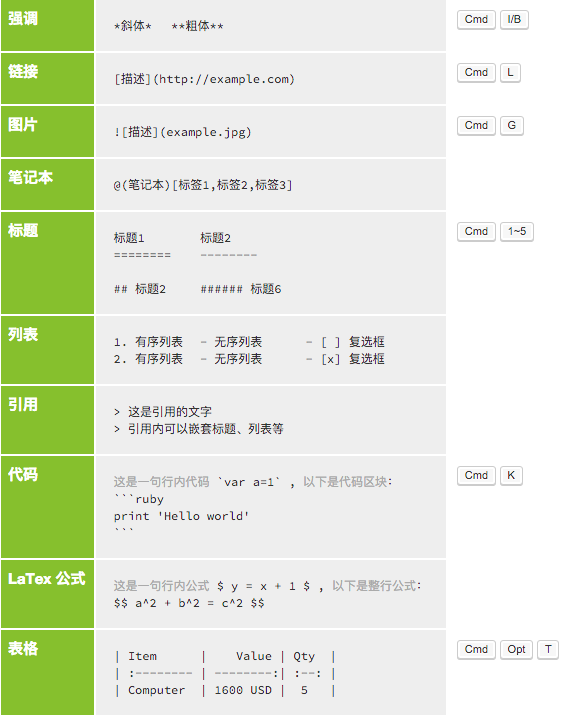
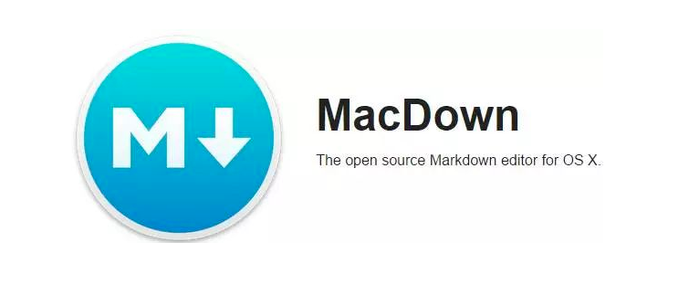
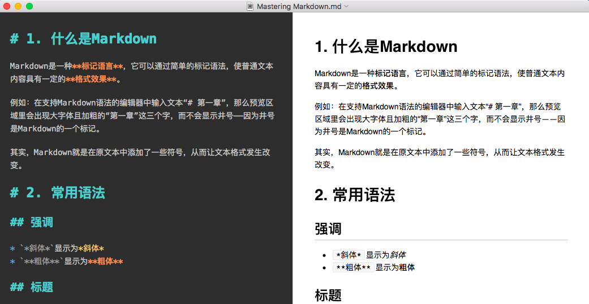

# 1. 什么是Markdown

markdown是一种**标记语言**，它可以通过简单的标记语法，使普通文本内容具有一定的**格式效果**。

例如：在支持markdown语法的编辑器中输入文本“# 第一章”，那么预览区域中会出现大字体且加粗的“第一章”三个字，而不会显示井号——因为井号是markdown的一个标记。

简单来说，markdown就是在原文本(raw text)中添加了一些符号，从而让文本格式发生改变。

# 2. 常用语法

## 强调

* `*斜体*`显示为*斜体*
* `**粗体**`显示为**粗体**

## 标题

* `# 一级标题`
* `## 二级标题`
* `### 三级标题`
* `#### 四级标题`
* 以此类推

## 链接

* 格式：`[描述](url)`
* 举例：`[百度](https://www.baidu.com)`显示为[百度](www.baidu.com)

## 图片

* 格式：``
* tip：将图片直接拖动至编辑器中，一般会自动生成路径

## 引用

* 格式：`> 内容`
* 举例：`> 这是引用部分`显示为

> 这是引用部分

## 列表

**无序列表**：使用*作为标识

```
* 第一行
* 第二行
* 第三行
```

以上内容将显示为：

* 第一行
* 第二行
* 第三行

**有序列表**：使用1. 2. 3. 等作为标识

```
1. 第一行
2. 第二行
3. 第三行
```

以上内容将显示为：

1. 第一行
2. 第二行
3. 第三行


## 代码

**行内代码**：用两个撇将代码包括进去，例如`print("Hello world")`

**代码块**：三个撇（+代码语言，可选）起始，三个撇结束

```python
import time
print(time.time())
```

## 表格

```
|Name       |Age           |Hobby      |
|:----------|-------------:|:---------:|
|Sam        |18            |Basketball |
```

显示为（注意冒号的写法，表示对齐方式）：

|Name       |Age           |Hobby      |
|:----------|-------------:|:---------:|
|Sam        |18            |Basketball |

# 3. 速查

来源：马克飞象



# 4. 编辑器推荐

越来越多的文本编辑器开始支持Markdown语法。

## Jupyter Notebook

> win & mac


Jupyter notebook的文本cell支持markdown语法，编辑完成后按下`ctrl+Enter`即可显示带有格式的文本内容。

## MacDown

> mac

> MacDown is an open source Markdown editor for macOS, released under the MIT License. It is heavily influenced by Chen Luo’s Mou.



纯Markdown编辑器，免费，轻便，整个软件只有13.3MB，功能完备，支持代码高亮，可以更换界面主题。

左侧为编辑区域，右侧为预览区域。



## Quiver

> mac

> Quiver is a notebook built for programmers. It lets you easily mix text, code, Markdown and LaTeX within one note, edit code with an awesome code editor, live preview Markdown and LaTeX, and find any note instantly via the full-text search.


左侧是笔记本栏，中间是笔记本内部笔记，右侧是编辑区域。


**“The Programmer’s Notebook”**是Quiver的Slogan，它是一款为程序员专门设计的笔记软件，容易上手同时功能强大：

* 支持纯文本、Markdown、LaTeX等语法格式；
* 支持数十种编程语言的自动高亮；
* 配备文档管理系统，能够对笔记进行分组整理；
* 主题丰富，备份方便……

## 马克飞象

> win & mac

> 马克飞象是一款专为印象笔记（Evernote）打造的Markdown编辑器，通过精心的设计与技术实现，配合印象笔记强大的存储和同步功能，带来前所未有的书写体验。


马克飞象本质与MacDown相差无几，但支持与印象笔记同步，可以将笔记以Markdown后的样式存储至印象笔记中，且附带文档管理系统。


如果你有双平台码字需求，马克飞象也能满足，因为印象笔记和马克飞象都支持Mac与Win双平台。

## Typora

> win & mac
>
> a markdown editor, markdown reader.


与MacDown不同，Typora仅仅拥有编辑窗口而没有预览区域。这一点与jupyter notebook相似，需要键入回车后才可以显示markdown语法渲染出的样式。


